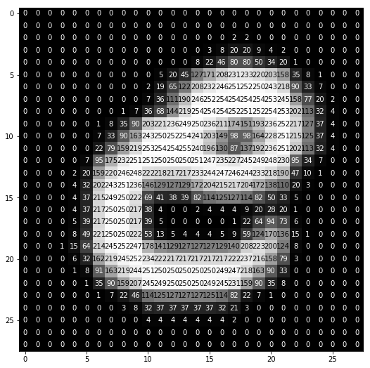

# Credits: Original Alphabet Recognition Through Gestures [](https://github.com/akshaychandra21/Alphabet_Recognition_RealTime)

## 1. Introduction

The rapid evolution of machine learning toolsets has enabled us to recognize common features of 2D image objects. This technology has already been found to be useful in fields of automation, self-guided vehicles, and especially: data-processing. Specifically, the recognition of letters will allow for real-time applications such as the signature verification, sign identification and interpretation, document translation, and more.
The following project was replicated to:

- Explore the uses of Convolutional Neural Networks and Multilayer Perceptrons in symbol recognition
- Attempt to improve upon the existing model

### Figure 1: Working Example

<!--  -->

## 2. Short Theory/Method

## 2.1 Algorithm Overview

The webcam extracts a frame in each iteration. The frame is processed to detect contours of a "drawing" coloured object. As long as the drawing object is on screen, the algorithm traces its movement path to create a list of adjacent points. Once the drawing object disappears from the screen, the points are drawn on a grey blackboard, processed, and then predicted by 2 seperate models. The original Multilayer Perceptron (MLP) model as well as a Convolutional Neural Network (CNN) models were built using using [Keras](https://keras.io/). These 2 models (CNN and MLP) were trained in advance with the terminal commands shown below. The activation color can be configured in the configuration files.

## 2.2 Model Improvements

These models were retrained with more epochs and an extra layer of dilation was also applied to the users inputs to better "exagerate" the features of a letter. In theory, the added draw thickness should reduce the "noise" caused by jagged lines drawn by the user.

Furthermore, each batch of activations were batch normalized to regularize the model. Regularization make the model more robust to slight differences in the user's handwriting and potentially even assist with classifying similarly shaped letters. This lead to a significant increase in accuracy.
Model accuracy with dropout was about 92% whereas the model accuracy using batch normalization achieved 97+%.

A batch normalized model was also trained using augmented training images however, this increased training time by more than 10x for the same number of epochs. This is due to the increased number of model fit steps per epoch and the additional generating algorithm steps. Despite increasing the steps, the model accuracy did not improve greatly. The final data augmentation-based model only achieved an accuracy of ~89%

For overall housekeeping, the code was segmented into reusable components which are called in succession at the main entry point.

## 2.3. Data Background

The extended [EMNIST "letters" dataset](https://www.kaggle.com/crawford/emnist) provided the handwritten letter data for training the models.

Shown below are examples of the labelled data provided:

<p align="center"></p>

Each letter in the dataset is represented by a 28x28x1 numpy array

<p align="center"></p>

## 3. Usage Instructions

### 3.1 Package Requirements

The code is in Python (version 3.6 or higher), OpenCV (4.5.1.48), and Keras (2.4.3 version) libraries.
To install all package requirements, please create a new conda environment and install the appropriate packages with the following:

```
conda create --name [Environment Name]
conda activate [Environment Name]
pip install -r config/requirements.txt
```

### 3.2 Building and training the CNN and MLP Models

Step 0: Configure model training parameters in config/config.py.

Step 1 - Execute `python mlp_model_builder.py`

Step 2 - Execute `python cnn_model_builder.py`

To retrain the new models, delete the existing models in the models folder and run the model builders above.
Alternatively: you may also set new model paths in the config to create and use brand new models.

### 3.3 Start Alphabet Recognition Application

Step 1 - Obtain an object of a bright color for the algorithm to detect.

Step 2 - Configure the color detection range in config/config.py. Some recommended color range schemes are listed in the config file.

Step 3 - Execute `python alphabet_recognition.py` to activate webcam detection and letter recognition.

Step 4 - Draw each letter carefully on a small portion of the screen.

## 4. Summaries

My retrained model test accuracies:

- MLP Test Accuracy: 93.37% with 75 Epochs
- CNN Test Accuracy with Batch Normalization: 94.2% with 500 Epochs
- CNN Test Accuracy with Dropout: 89.1% with 500 Epochs

## Additional Resources

The original author has written [a tutorial post on medium](https://medium.com/@akshaychandra21/97e697b8fb86) explaining the code.
The original author has another similar application: [Digits Recognition](https://github.com/akshaychandra111/Digits_Recognition_RealTime)
